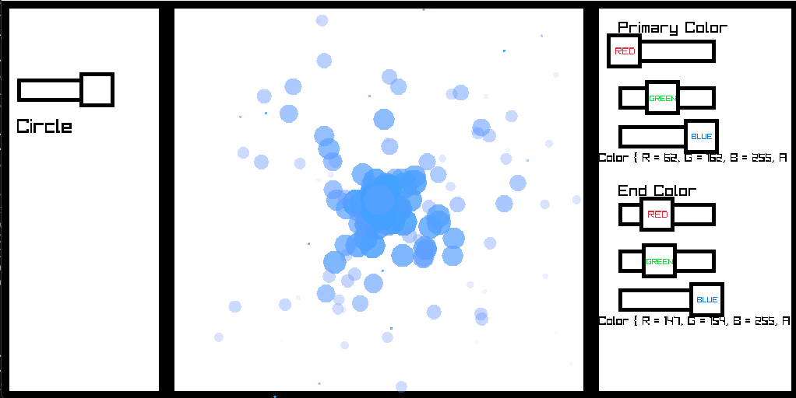

# What is this repository
This is a basic particle editor that I made using Raylib and C#. It uses my own custom UI system instead of a built in library as well as my own particle system. A snippet of the early version of this editor is shown below

### Project Status (CREATION)
Remember this project is still in the creation process and is not finishing, beware of hidden bugs, messy code, and redudant solutions. I plan on adding better, flexible, and simpler UI for easier implementation and use.
