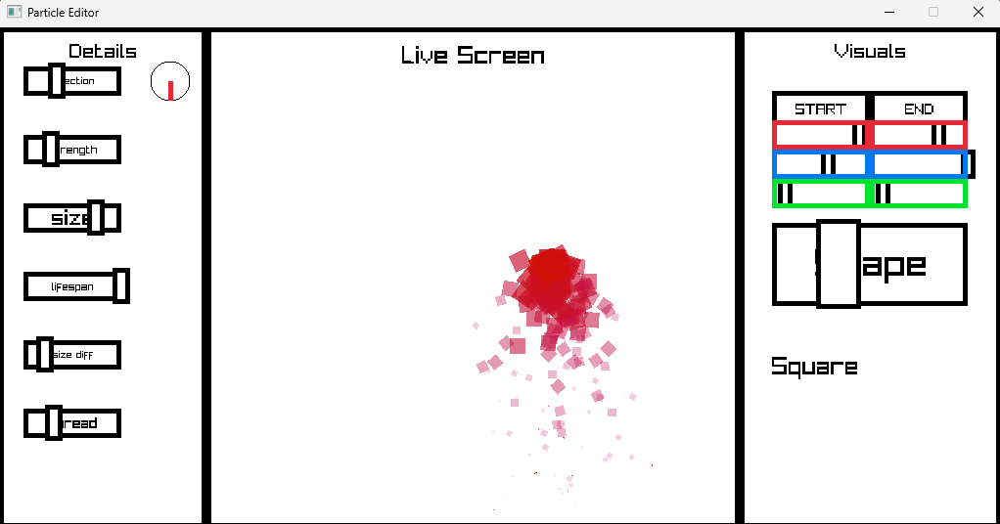
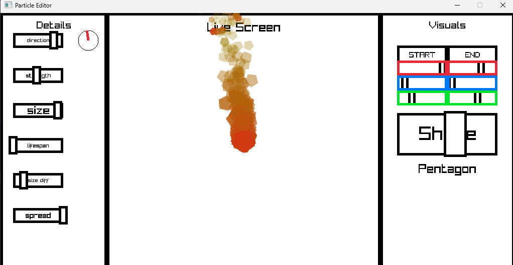
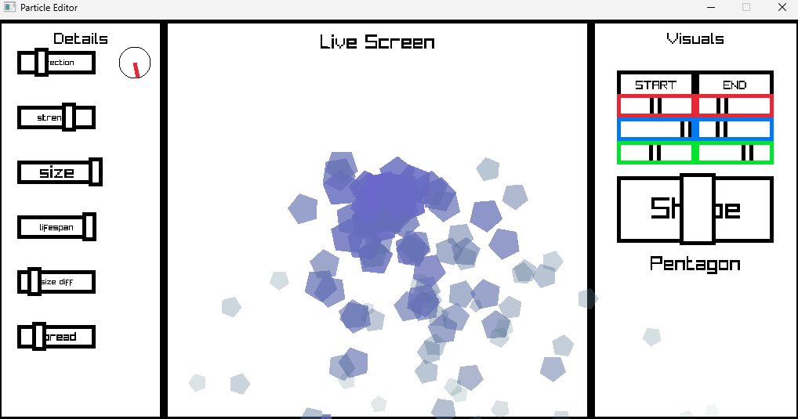
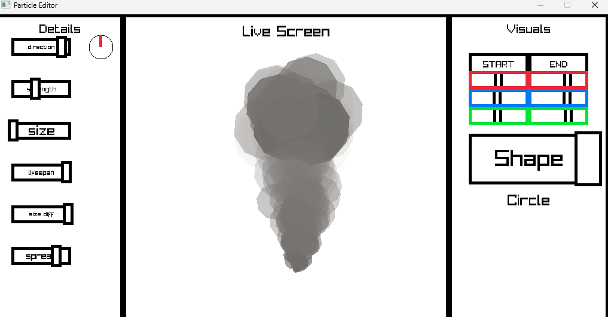
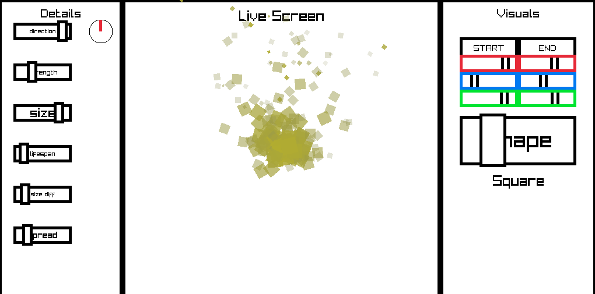

# Refined Particle Editor


### Description
This is a basic particle editor that I made using Raylib and C#. It uses my own custom UI system instead of a built in library as well as my own particle system. It features the ability to change many parameters on the particles behaviors and visuals.

### Technologies
I use Raylib with C# bindings for this project. You can add raylib to your C# project by:
```
    dotnet add package Raylib-cs
```

### Visuals
Early tests of the project


Particle effects I could make with this project:

###### Fire


###### Water


###### Smoke


###### Sand


